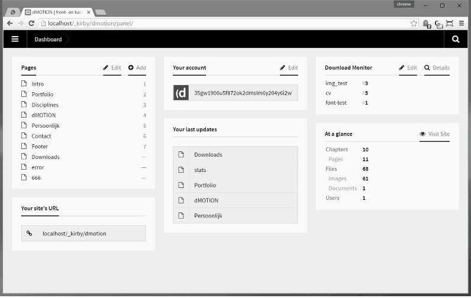

# Kirby - Download Monitor

#### Version 1.0.0 - 2016-07-02

- Initial Public Offering...

#### Version 1.1.0 - 2016-07-03

- Option to manual set a startcount
- Extra check if download is allowed
- Small code enhancements
- Updated README file

****

###What is it?###

Kirby Download Monitor allows you to get more insights in your downloads;

- Hide the downloadpath for your assets.
- Monitor the hits for every download.
- Get detailed logs for every download.
- All downloads centralized in one place.
- Quick overview of all downloads (widget).
- ...and more!

More info about Kirby can be found at http://getkirby.com

###Installation###

- Download the .zip and extract it to the root of your site.
- Don't know which files? Just use "/content" and "/site".
- Several directories will be created; be carefull not to overwrite existing ones.
- A new page is added; downloads.
- From the new page, you can add / modify / delete all your downloads.
- When visiting the page from the dashboard, all the detailed stats are shown.
- Remember; only registered / logged-in users have access to these stats.

###Important!###

- By default, the downloadspage is not *multi-langual*. If you have a *multi-langual set-up*, please change the name **\content\downloads\downloads.txt** manually to **\content\downloads\downloads.{language_code}.txt**

****

*Version 1.0.0*